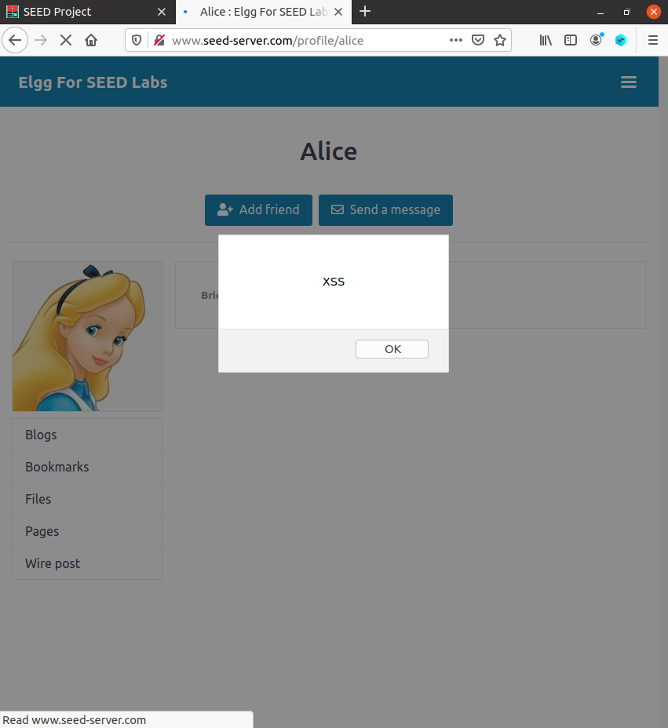
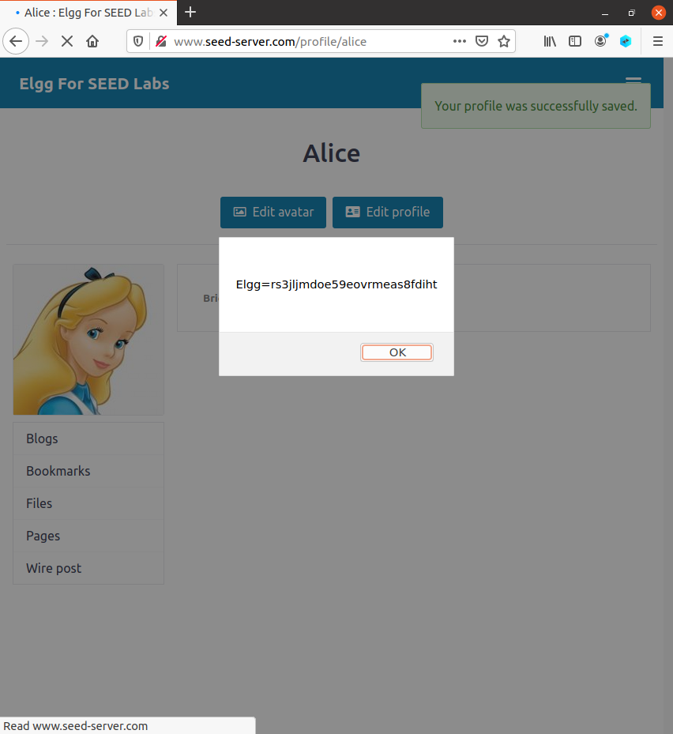
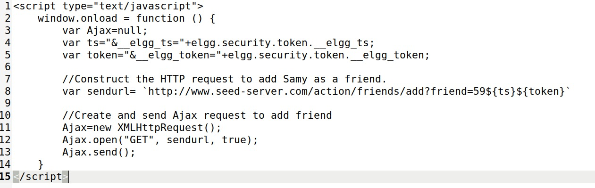

# Tarefas para as semana 10 e 11

## Task 1: Posting a Malicious Message to Display an Alert Window

The goal in this task is to embed a JavaScript program in a profile, such that when another user views the profile, an alert window will be displayed when the program is executed. To achieve that, we clicked on the option to edit the profile and in the "About me" section, we added the code given in the description of the task: 

****

After that, from another user's profile, when we click in the Alice's profile, the one where we added the code above, we see a message in the form of a pop-up window shown below.

## Task 2: Posting a Malicious Message to Display Cookies

For this task, the goal is to embed a JavaScript program in a profile, such that when the user views its own profile, an alert window would appear with that user's cookies. To achieve that, we did a similar thing as the previous task, adding this code to the brief description:

****

After that, when we log into Alice's profile, on her profile page, a see a pop-up window with a message containing the cookies.

## Task 3: Stealing Cookies from the Victim’s Machine

For this task, the goal is to, instead of the the user being the only one to see the cookies, we want to send them to the attacker. For that, we changed the brief description with the follwing code:

****

We can then see the cookies by doing the command *nc -lknv 5555*.

## Task 4: Becoming the Victim’s Friend

For this task the goal is to write a program that writtes an XSS worm that adds Samy as a friend to any other user that visits Samy's profile. For that, we started by understanding what happens when a friend request is sent. 

After analysing our information and the code that was given to us, we only needed to build the url that would be used to achieve the goal of our task and add an user as a friend when they visited Samy's profile, we gathered that Samy's id was 59 so, to achieve our goal, we added the follwing code to the "About me" section , in *Edit HTML* mode:

We then answered some questions:

**Question 1: Explain the purpose of Lines ➀ and ➁, why are they needed?** The lines 1 and 2 get the values of the __elgg_ts and __elgg_token variables and this values are used against Cross Site Request Forgeru attacks. This values change every time a page is loaded and because of that, they need to be accessed every time.  

**Question 2: If the Elgg application only provide the Editor mode for the "About Me" field, i.e., you cannot switch to the Text mode, can you still launch a successful attack?** No, because if the application only provided the Editor mode, the attack will not be successful because this expecific mode adds some extra HTML and some symbols change.

