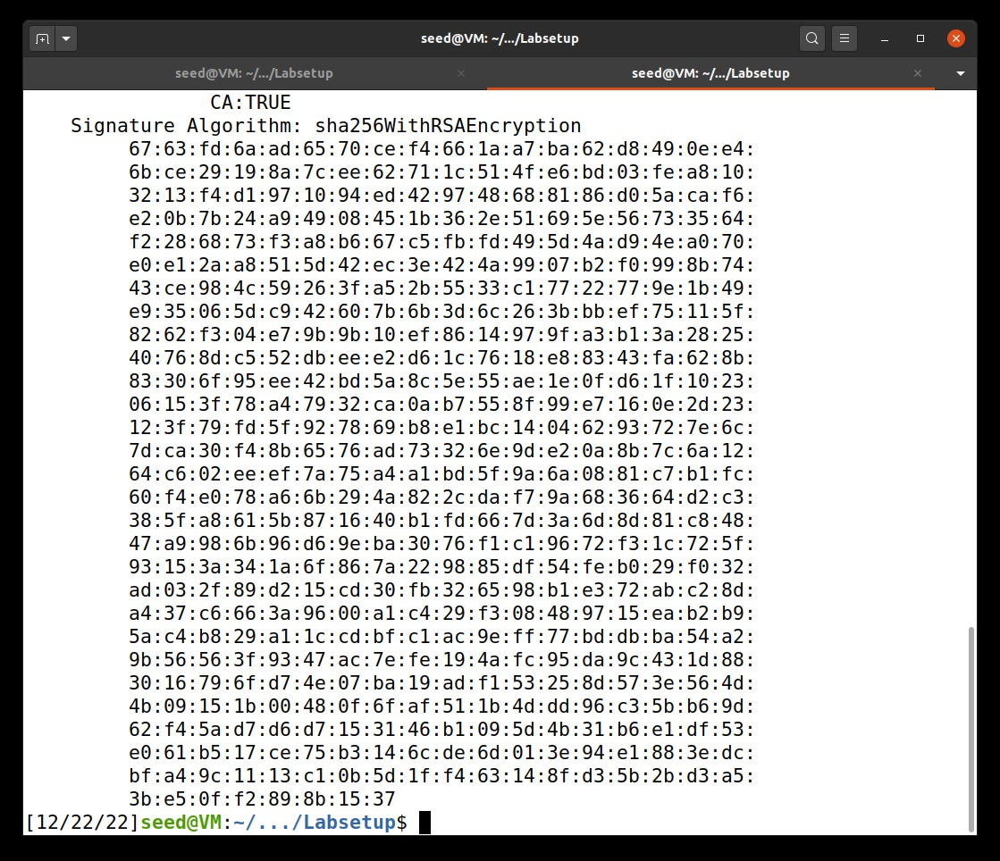
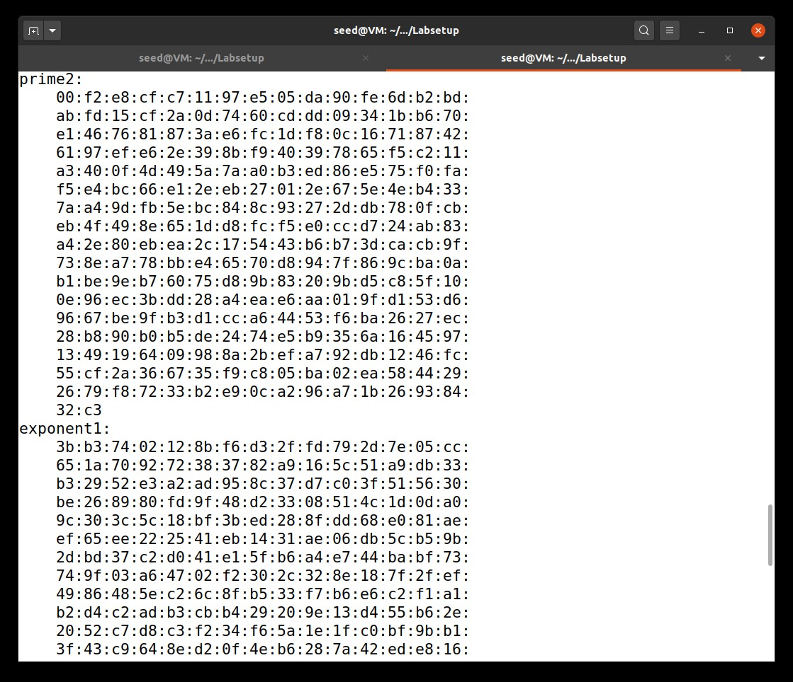

# Tarefas para a semana 12 e 13

## Task 1: Becoming a Certificate Authority (CA)

For this task, we want to become a CA so that we can issue a certificate for others. To be able to achieve that, we started by copying the OpenSSL configuration file into our Labsetup folder by doing the following command:

**cp /urs/lib/ssl/openssl.cnf ./openssl.cnf**

What our Labsetup looks like:

After that, insid the *openssl.cnf* file, the following content needs to be present:

Afterwards we need to create the *demoCA* folder and add all the necessary files into it, and the we are going to start generating the self-signed CA certificate using the command given previously.

We can then do the following commands to look at the decoded content of the X509 certificate and the RSA key as plain text:

**openssl x509 -in ca.crt -text -noout  
openssl rsa  -in ca.key -text -noout**

Then we answered some questions:

**What part of the certificate indicates this is a CA’s certificate?**

CA:TRUE

**What part of the certificate indicates this is a self-signed certificate?**

Because X509v3 Subject Key Identifier = X509v3 Authoriry Key Identifier

**In the RSA algorithm, we have a public exponent e, a private exponent d, a modulus n, and two secret numbers p and q, such that n = pq. Please identify the values for these elements in your certificate and key files.**

The values are shown in the following order: n (modulus), public exponent (publicExponent), d (privateExponent), p (prime1) and q (prime2), as seen in the screenshots above.

## Task 2: Generating a Certificate Request for Your Web Server

We used the following command to generate a request using the new server key:

## Task 3: Generating a Certificate for your server

The following command turns the certificate signing request (server.csr) into an X509 certificate (server.crt), using the CA’s ca.crt and ca.key:

For security reasons, the default setting in *openssl.cnf* doesn't allow the *openssl ca* command to copy the extension field from the reuqest to the final certificate so, to complete this task, we need to enable it. To achieve that we just need to uncomment the line underlined in the following screenshot:

Then we just need to use the following command to print out the decoded content of the certificate:

## Task 4: Deploying Certificate in an Apache-Based HTTPS Website

For this task, we started by creating a new directory, *task4*, inside Labsetup, then, inside is a Dockerfile that we called **l08g04_apache_ssl**, the two index files that were previously provided, and a folder *certs*.

The **l08g04_apache_ssl.cnf** contains the following:

We then changed the *docker-compose* file to contain the build we want.

We can then run it inside the container:

We then enter the link.

## Task 5: Launching a Man-In-The-Middle Attack

For this task, we targeted the website www.example.com. After that, we modified the /etc/hosts file to emulate the result of a DNS cache positioning attack by mapping the hostname to our web server: 10.9.0.80   www.example.com.
After that, when we access www.example.com, we are able to see the page, but with a warning about it's insecurity. This happens because, at this point, we had a CA's certificate does not contain the example website.

## Task 6: Launching a Man-In-The-Middle Attack with a Compromised CA

For this task, we had to assume that our CA was compromised by an attacker, so that the attacker can generate its own certificates for the website.

First, we need to generate the certificate for our website www.example.com, with the following command:

Afterwards we needed to sign our certificate with our CA:

After we also needed to add it to the Dockerfile:

Then we could rebuild our container and start it, and when loading into the website we obtain the following:

# CTF semana 12 e 13

## Desafio 1

First we need to find our enc_flag by doing the following:

Then we put together our exploit:

And obtain our flag:

