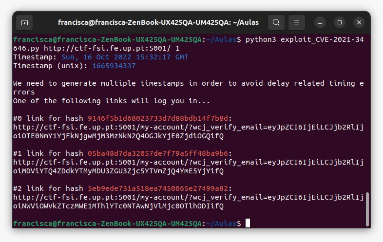
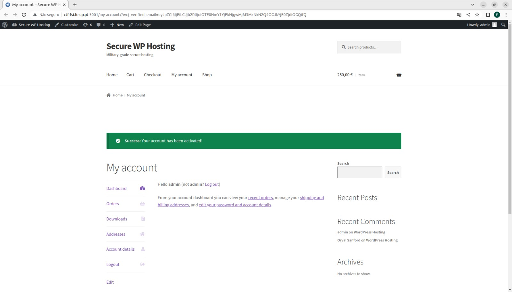
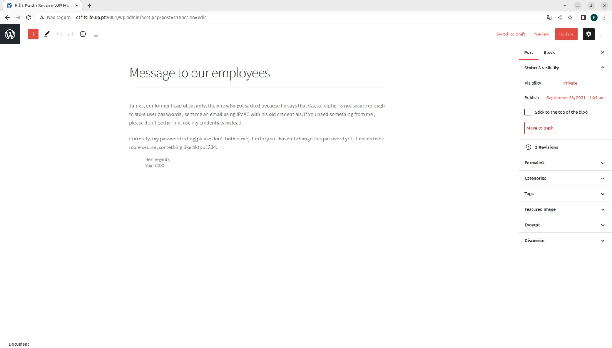

# Tarefa da semana #4

## Task 1: Manipulating Environment Variables 

When we use *printenv*, it lists all the environment variables of the system. If we want a more specific environment, we can use *printenv PWD*, which prints the environment in which we are.

## Task 2: Passing Environment Variables from Parent Process to Child Process

When *fork()* is used in the program, the child process has the same environment as its parent, so when we use *printenv* we don't see a difference between the environments.

## Task 3: Environment Variables and *execve()* 

When we use the array *environ*, it is used as the environment of the program, replacing the current process. When the variable *Null* is passed, it means that we are not using any environment variables.

## Task 4: Environment Variables and *system()*

When running this program, we can see that it prints all the variables in ../bin/env.

## Task 5: Environment Variable and Set-UID Programs

Set-UID is a special type of permission on Unix, that allows programs to run with elevated privileges. After executing the commands in step 3, we see that the variable LD_LIBRARY_PATH did not change, unlike the other. This happens as a defence mechanism to stop the non-root user from changing linked libraries and exexute malicious code.

## Task 6: The PATH Environment Variable and Set-UID Programs

By passing the *ls* command on the system function, and since the system has root privileges, the program will be executed with elevated privileges and can do harm, bypassing the mechanism that was able to remove the privileges of the non-root users.

# CTF

The first step to solve this challenge was to enter the Wordpress page and navegate through it, including seeing the html of the page, so that we could gather information in order to help us look for a vulnerability. We gathered the following information:

- Wordpress version: 5.8.1
- WooCommerce version: 5.7.1
- Plugins: Booster for WooCommerce plugin - version 5.4.3
- Users: admin, Orval Sanford

With all this information, we were able to find the CVE-2021-34646, that seemed to work with the information that we had. By using the exploit found here https://www.exploit-db.com/exploits/50299, we achieved our goal. 

Here are some screenchots of our procedure:

