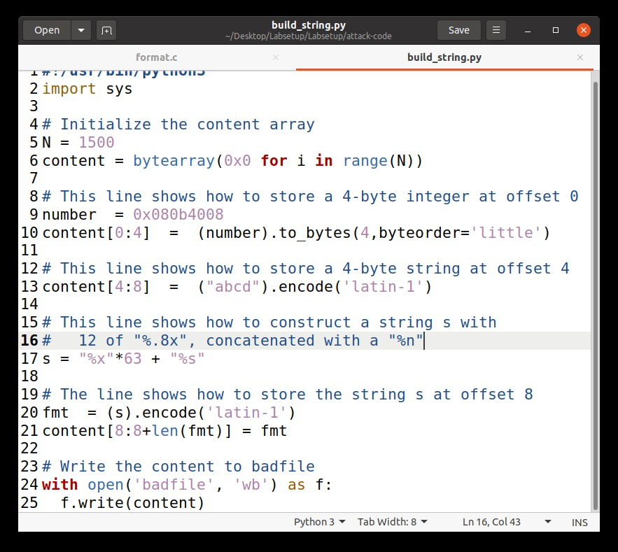

# Tarefas para a semana #5

## Task 1: Getting Familiar with Shellcode

When we run the program, we get the root shell with the a32.out. This happens because the program copies the shellcode to the stack.

## Task 2: Understanding the Vulnerable Program

This task is more of an explanation of the buffer overflow vulnerability. What the progam does is allow insertion of malicious code in the stack overflow, since it contains a strcpy call that writes a string into a buffer bigger than the buffer size because the function doesn't check limits. Since the program is set-UID, the user can get access to the root shell.

## Task 3: Launching Attack on 32-bit Program (Level 1)

### 5.1 Launching Attacks
Here is the screenshots for the execution of this part:

### 5.2 Launching Attacks

 

For this part, this is how we calculated the values:

**shellcode** - here we just needed to add the binary code for the 32 bit presented in the *call_shellcode.c*.  

**start** - the buffer has a size of 517 and our shell code has a size of 27 bytes and since we are putting our shellcode in the end of the stack, we need to subtract 527 and 27 that leads us to the 490 presented.  

**ret** - this is the return address that will be pointing to our shellcode. Our buffer starts at 0xFFFFCB0C so we do 0xFFFFCB0C + 490, because we are putting our shellcode 27 bytes before the end of the buffer, that gives us our return address which was 0xFFFFCCF6.  

**offset** - this gives the place where we want to inject in our return adress so of our ebp address (0xFFFFCB78) we subtract our buffer address (0xFFFFCB0C), we know that that the ebp address starts at 108 bytes after the buffer, lastly we need to add the size of the ebp, which we know is 4 bytes, and we get 112.  

 
