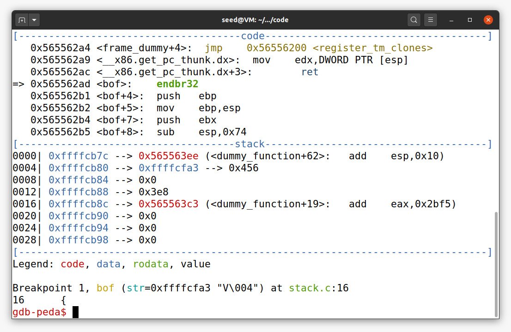

# Tarefas para a semana #5

## Task 1: Getting Familiar with Shellcode

When we run the program, we get the root shell with the a32.out. This happens because the program copies the shellcode to the stack.

## Task 2: Understanding the Vulnerable Program

This task is more of an explanation of the buffer overflow vulnerability. What the progam does is allow insertion of malicious code in the stack overflow, since it contains a strcpy call that writes a string into a buffer bigger than the buffer size (this happens because the function doesn't check limits). Since the program is set-UID, the user can get access to the root shell.

## Task 3: Launching Attack on 32-bit Program (Level 1)

### 5.1 Launching Attacks
Here is the screenshots for the execution of this part:

### 5.2 Launching Attacks
The goal is to exploit the buffer-overflow vulnerability.

 

For this part, this is how we calculated the values:

**shellcode** - here we just needed to add the binary code for the 32 bit presented in the *call_shellcode.c*.  

**start** - the buffer has a size of 517 and our shell code has a size of 27 bytes and since we are putting our shellcode at the end of the stack, we need to subtract 517 and 27. That leads us to the 490 presented.  

**ret** - this is the return address that will point to our shellcode. Our buffer starts at 0xFFFFCB0C so we do 0xFFFFCB0C + 490, because we are putting our shellcode 27 bytes before the end of the buffer. That gives us our return address which was 0xFFFFCCF6.  

**offset** - this gives the place where we want to inject into our return address, so with our ebp address (0xFFFFCB78) we subtract our buffer address (0xFFFFCB0C). We know that the ebp address starts at 108 bytes after the buffer. Finally, we need to add the size of the ebp, which we know is 4 bytes, and we get 112.  

After running the program, this is what we get:

 

# CTF Semana 5

## Desafio 1

The goal of this challenge was to help us understand the buffer-overflow vulnerability.
After analysing the code we were able to answer the questions below:

**Is there any file that is opened and read by the program?** Yes, the file *mem.txt* is opened to be read by the program.  
**Is there any way to control the file that was opened?** Yes, by modifying the name of the file that we want to open in *meme_file*.  
**Is there any buffer-overflow? If yes, what can you do?** A buffer-overflow can occur because the buffer that allows the person to write allocates memory for only 20 characters while the function scans reads 28 characters. The extra 8 characters that we write will be inserted in the string *meme_file* and the flag needed will be presented.  

## Desafio 2

Just like the previous challenge, we analised the code and answered a few questions:

**What alterations were made?** There is a new variable being used, *val*, the *scanf* functions reads 32 characters instead of the previous 28 and the file can only be opened if the variable *val* equals to 0xfefc2122.  
**Do they fully mitigate the problem?** No. To read the flag we need to perform a task similar to the one we performed on the previous challenge, but additionally we need to make sure that the variable *val* is equal to 0xfefc2122.  
**Is it possible to overcome mitigation using a technique similar to the one used before?** Yes, by adding the value of the variable *val* to the sequence previously used. In our case, we used the string “abcdefghijklmnopqrst\x23\x22\xfc\xfeflag.txt” since the first 20 characters weren’t relevant for this exercise, followed by the 4 characters that correspond to the variable *val* value, written in the opposite order, and finally the name of he file that we want to open and read.  

