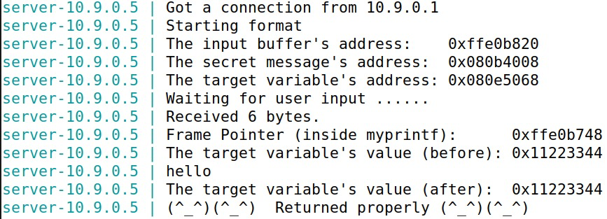
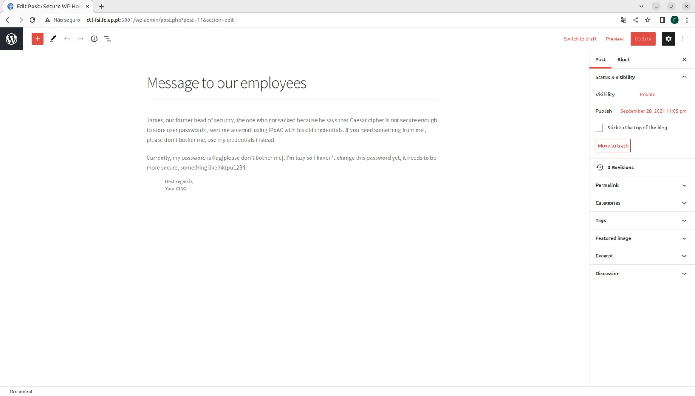
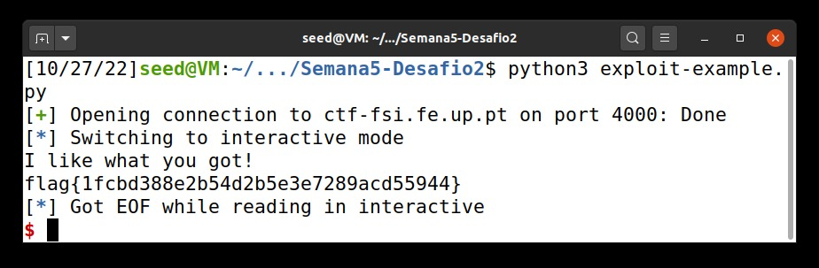
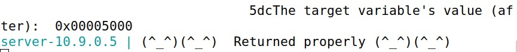
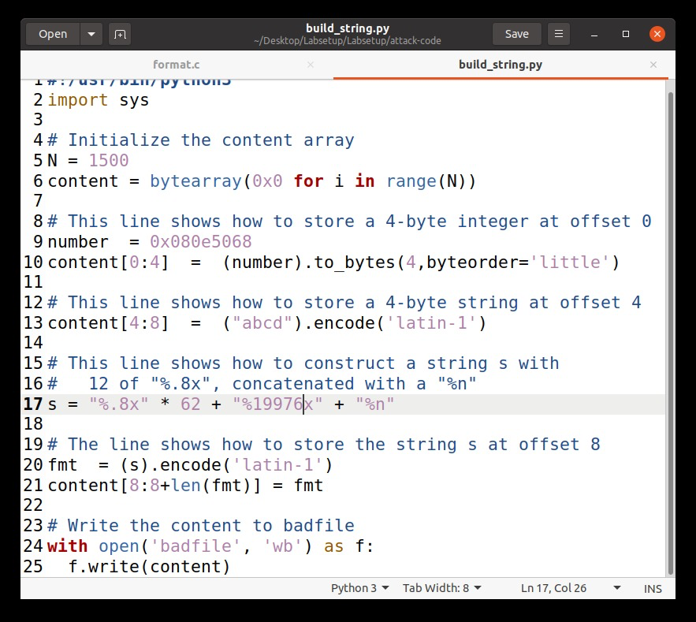

# Tarefa para a semana #7

## Task 1: Crashing the Program

At first we started by sending a *hello* message, and the program sent a *returned properly* message.

After that, the goal of task is to exploit the format-string vulnerability. In this case, we are going to exploit the the *printf()* function as well as the format-string.

In our string, we are going to add *%n* so that when the function *printf()* runs and tries to print the string, it will overwrite the return address to exit the function, which means that our program gets stuck, aka crashing the program. 
This happens because the *%n* in a string loads the variable where the pointer is located and change the value of the variable to the number of characters printed by *printf()* so far.

 

## Task 2: Printing Out the Server Program's Memory

### Task 2.A: Stack Data

To help us this exploit, we are using the *%x*, by writing it as needed ultil we reach our string "0xbfffeeee". We figured we needed to inject a total of 63 *%x* by trial and error until we finally reached our string. The *%x* allows unlimited dumping of the memory segment values. 

### Task 2.B: Heap Data

To perform this task, we needed to alter our string to the address of the secret message that the server already provides us (0x080b4008). Then, we do part of what we already did in the previous task, use the *%x* to jump through the memory and we also execute a *%s* to print the string.
By executing our build_string.py, we see that the secret message was "A secret message", as seen below.

## Task 3: Modifying the Server Program’s Memory

### Task 3.A: Change the value to a different value

For this task, we needed to change the value of the *target* variable. Just like in the task 3.b we have to change our string and make it the address, in this case, of the target variable, provided aswell by the server (0x080e5068). We first need to skip 63 addresses so we can alter our *target* variable, and then we add *%n* to the end of our string so then it can overwrite the value of *target*.

## Task 3.B: Change the value to 0x5000

For us to be able to change the variable's value to 0x5000 we first understood that it corresponds to 20480 in decimal, which that we have to write 20480 bits of information but since the server has a limit of 1500, we are going to take advantage of the *printf()* function.

In this case, we subtracted the number of bytes of the dirence that we had discovered in the previous tasks, leading to this: **20480 - 8*63 = 19976** and plus the *%n*, that we already know that prints the number of characters in the string so far.

