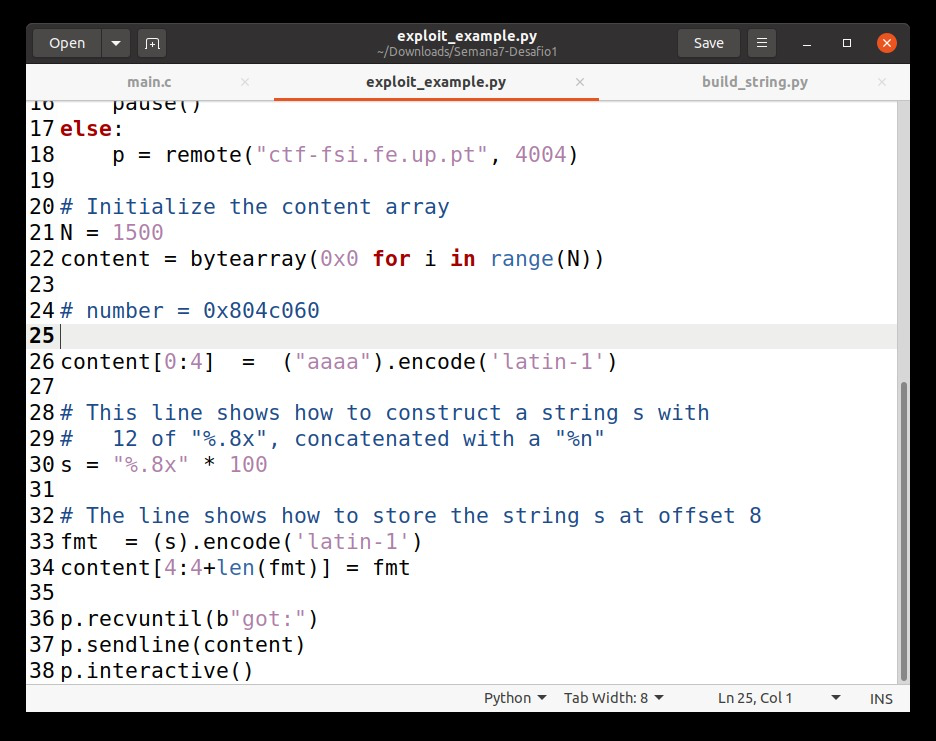
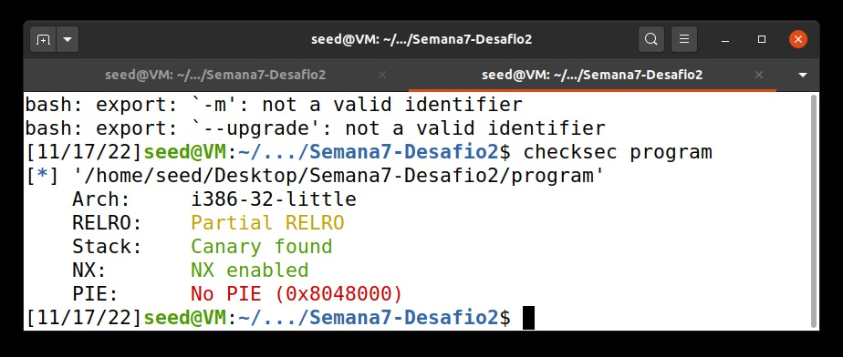

# Tarefa para a semana #7

## Task 1: Crashing the Program

At first we started by sending a *hello* message, and the program sent a *returned properly* message.

After that, the goal of task is to exploit the format-string vulnerability. In this case, we are going to exploit the the *printf()* function as well as the format-string.

In our string, we are going to add *%n* so that when the function *printf()* runs and tries to print the string, it will overwrite the return address to exit the function, which means that our program gets stuck, aka crashing the program. 
This happens because the *%n* in a string loads the variable where the pointer is located and change the value of the variable to the number of characters printed by *printf()* so far.

 

## Task 2: Printing Out the Server Program's Memory

### Task 2.A: Stack Data

To help us this exploit, we are using the *%x*, by writing it as needed ultil we reach our string "0xbfffeeee". We figured we needed to inject a total of 63 *%x* by trial and error until we finally reached our string. The *%x* allows unlimited dumping of the memory segment values. 

### Task 2.B: Heap Data

To perform this task, we needed to alter our string to the address of the secret message that the server already provides us (0x080b4008). Then, we do part of what we already did in the previous task, use the *%x* to jump through the memory and we also execute a *%s* to print the string.
By executing our build_string.py, we see that the secret message was "A secret message", as seen below.

## Task 3: Modifying the Server Program’s Memory

### Task 3.A: Change the value to a different value

For this task, we needed to change the value of the *target* variable. Just like in the task 3.b we have to change our string and make it the address, in this case, of the target variable, provided aswell by the server (0x080e5068). We first need to skip 63 addresses so we can alter our *target* variable, and then we add *%n* to the end of our string so then it can overwrite the value of *target*.

## Task 3.B: Change the value to 0x5000

For us to be able to change the variable's value to 0x5000 we first understood that it corresponds to 20480 in decimal, which that we have to write 20480 bits of information but since the server has a limit of 1500, we are going to take advantage of the *printf()* function.

In this case, we subtracted the number of bytes of the diference that we had discovered in the previous tasks and 8 that corresponds to our offset, leading to this: **20480 - 8*62 - 8 = 19976** and plus the *%n*, that we already know that prints the number of characters in the string so far.

# CTF 

## Challenge 1

After executing *checksec*, we had the following result:

With this information, we gathered that the program has Partial RELRO, which means there is no risk of a buffer overflow. There is also a canary protecting the return address, NX is enabled so it means that the stack has no execute permission. We also see that there is no PIE, that is responsible for providing some address randomness.

We then analysed the code and answer the following questions:

*Which is the line of code where the vulnerability is?*  The vulnerability is in line 27 **printf(buffer);**.

*What does the vulnerability allows you to do?*  This vulnerability allows us to check content of the memory address of the buffer. In this case, we want to check the address of the *flag* variable. For that we used *gbd* to obtain that information, by using the command *p &flag*, we learned that our flag is stored in 0x804c060.

*What is the functionality that allows you to obtain the flag?*  We are able to get the flag because of a format-string vulnerability, that allows us to read from an arbitrary memory place.

After discovering the address of our *flag*, by inserting the string “aaaa%x” we see that the buffer is the first thing the printf gets. 

This means that we can place our flag address in the beginning of our payload followed by a *%s* so it prints the flag that we want.

## Challenge 2

After executing *checksec*, we had the following result:

We concluded that the restrictions were the same as in the first challenge, the program has Partial RELRO, which means there is no risk of a buffer overflow. There is also a canary protecting the return address, NX is enabled so it means that the stack has no execute permission. We also see that there is no PIE, that is responsible for providing some address randomness.

After analysing the code, we answered a few more questions:

*Which Is the line of code where the vulnerability is? And does the vulnerability allow you to do?* The vulnerability is in line 13 **printf(buffer);**.

*The flag is loaded into memory? Or is there any functionality that we can use to have access it?* No, it isn’t. We can access the flag through the shell when the key value is *0xbeef*.

*To unlock this functionality what do you have to do?* 

For us to be able to get the flag, we are going to use the method we previously used, but instead of targeting a flag, we target the variable key by using the command *p &key*.

After that we preceded to use the same method as challenge 1 to see what the offset might be, and conclude once again that the adresses were in consecutive places.

Now we know that we need to write the value *0xbeef* into our address 0x804c034. The value *0xbeef* corresponds to 48879 in decimal, with that in mind we need to subtract the number of characters that represents our string "aaaa" (4) and subtract 4 more that belong to the space that is needed for the address value, that leaves us with 48871. **(48879-4-4=48871)**

Then a new shell is presented and we used the command *cat flag.txt* to see the flag.

