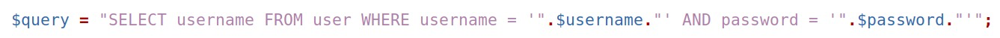
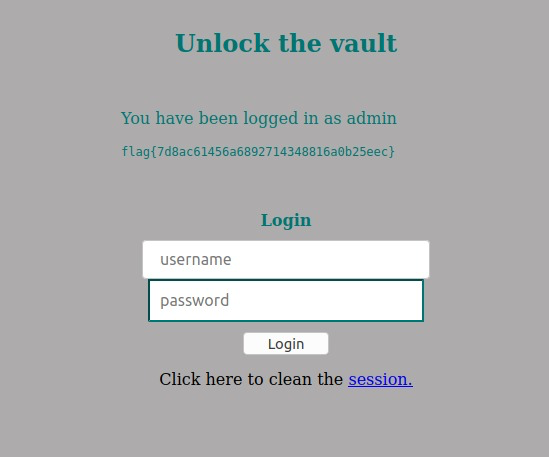
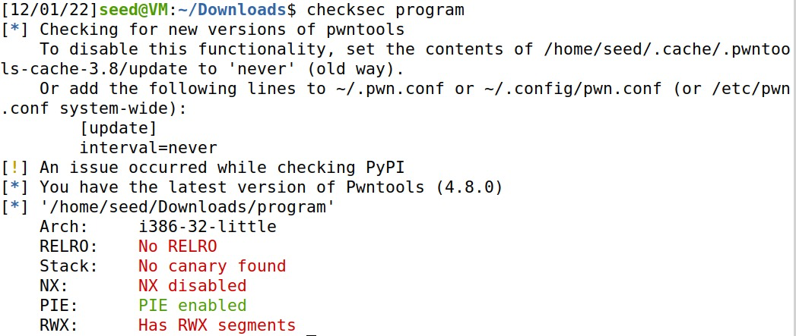
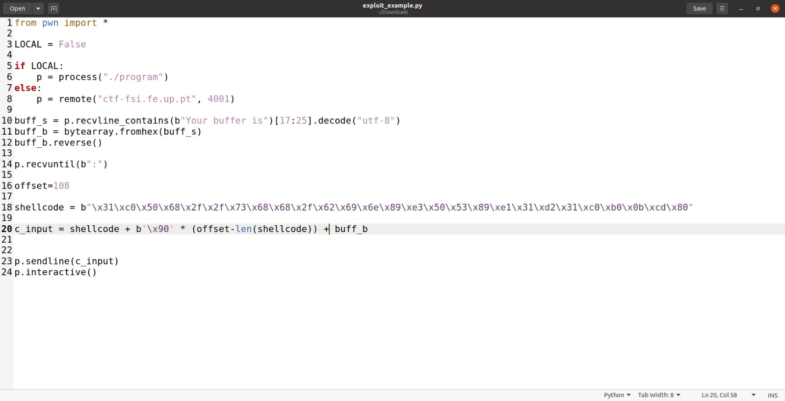
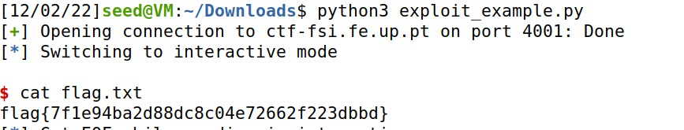

### Tarefas para as semana 8 e 9 

## Task 1: Get Familiar with SQL Statements

First we need to get control of the MYSQL container and then start MySQL.

The querie that gives us access to the employee Alice profile information is: 

**SELECT * FROM credential WHERE Name = 'Alice'**

## Task 2: SQL Injection Attack on SELECT Statement

# Task 2.1: SQL Injection Attack from webpage

For this task, it was asked for us to access the admin account, while only knowing the username. So, for the username field, we put **admin'#** so it can comment the part that had the password variable. By doing this, we were able to see the admin information.

# Task 2.2: SQL Injection Attack from command line

For us to complete this task without using the webpage, we did the following in the command line and got the access to see the admin information:

**curl 'www.seed-server.com/unsafe_home.php?username=admin%27%23&Password='**

# Task 2.3: Append a new SQL statement

For this task we tried to run two SQL statements foe the attack, but it wasn't possible because of the PHP MYSQLi extension. This extesion doesn't allow the execution of multiple queries.

## Task 3: SQL Injection Attack on UPDATE Statement

# Task 3.1: Modify your own salary

To change Alice's salary we first need to log as Alice, by giving the username field the input **Alice'#** since we don't know her password. After that we are going to use the edit profile functionality to achieve our task, by putting in the nickname field **', salary='50000**.

# Task 3.2: Modify other people’ salary

For this task we need to alter someone else's salary and to do that, we just need to do **',salary=1 WHERE Name='Boby';#** on the nickname field of Alice's profile.

# Task 3.3: Modify other people’ password

The goal of this task is to change Boby's password. We started by hashing a new password *password* .
Then on Boby's edit profile page we do the command **',password='5baa61e4c9b93f3f0682250b6cf8331b7ee68fd8' where Name='Boby';#** and sucessfully changed his password.

We can now log into his account using our password.

### CTF semana 8 e 9

## Challenge 1

After analysing the code, we identified a vulnerability in the login section in the folling line:

As we can see in this code, there is a string without sanitization being created directly from the user input. This element can be easily exploit if the user has malicious intentions, and it's what's going to help us log into the system.

To complete this challenge we focused on the password field, and by looking at the line of code that has the vulnerability, we see that the password is inserted inside *''*. So we are going to perform a SQL injection payload *OR 1=1* followed by *--* so it can help us avoid problems, that represents an inline comment.  

After inserting this information we were able to obtain our flag.  

**user: admin  
password:' OR 1=1--'**

## Challenge 2

With this information, we gathered that the program doesn't have RELRO, which means there is risk of a buffer overflow. There is no canary protecting the return address, NX is disabled so it means that the stack has execute permission, but we see that there is PIE, that is responsible for providing some address randomness, and there is also RWX segments.  

To complete this challenge we are going to be calling a shell from the server (reverse shell), that we are able to achieve by doing the following:

We then execute the code and enter the *cat flag.txt* to get our desired flag.

